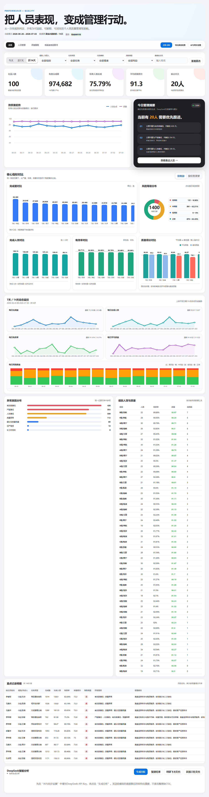

# AI 标注人效质量智能监控看板

面向数据标注团队管理者的轻量级 Web Dashboard，将人员产出、人效、有效率、质量和风险规则转化为可追踪的管理信息。

## 在线体验

https://orynoka.github.io/ai-annotation-quality-dashboard/



## 核心能力

- 14 天动态监控：支持今天、近 7 天和近 14 天切换。
- 管理指标：在岗人数、有效完成量、标准人效达成、平均质量和重点关注人数。
- 交互趋势：数据点悬停/点击查看详情，图例可控制人效与质量折线显隐。
- 质量分析：平均质量与最低质量复式柱状图，保留 85 分准入线。
- 多维筛选：按组别、任务、难度、风险和人员搜索。
- 人员管理：聚合个人表现、风险原因与跟进状态。
- 规则评测：展示规则口径、命中数量与关联人员。
- CSV 导出：导出当前筛选结果。

## 数据说明

线上演示使用 2026-06-20 至 2026-07-03 的 14 天模拟数据，共 1,400 条记录。所有内容仅用于产品演示与作品集展示，不代表真实企业或真实员工表现。

## 产品架构

```text
GitHub Pages
  ├─ index.html                 看板界面、规则与交互
  └─ data/offline-history.js    14 天公开模拟数据
```

GitHub Pages 版本为静态作品集演示，支持数据查看、筛选、交互图表、会话内 CSV 上传和结果导出。DeepSeek 分析、历史持久化和飞书云文档推送依赖独立后端，因此在线演示版不开放这些操作。

## 本地查看

下载仓库后直接打开 `index.html` 即可，无需安装依赖。

## 隐私与安全

- 仓库不包含 API Key、Token、App Secret 或本机配置。
- 不要将真实生产数据直接提交到公开仓库。
- 线上上传的 CSV 仅在当前浏览器页面中处理，不会写回本仓库。

